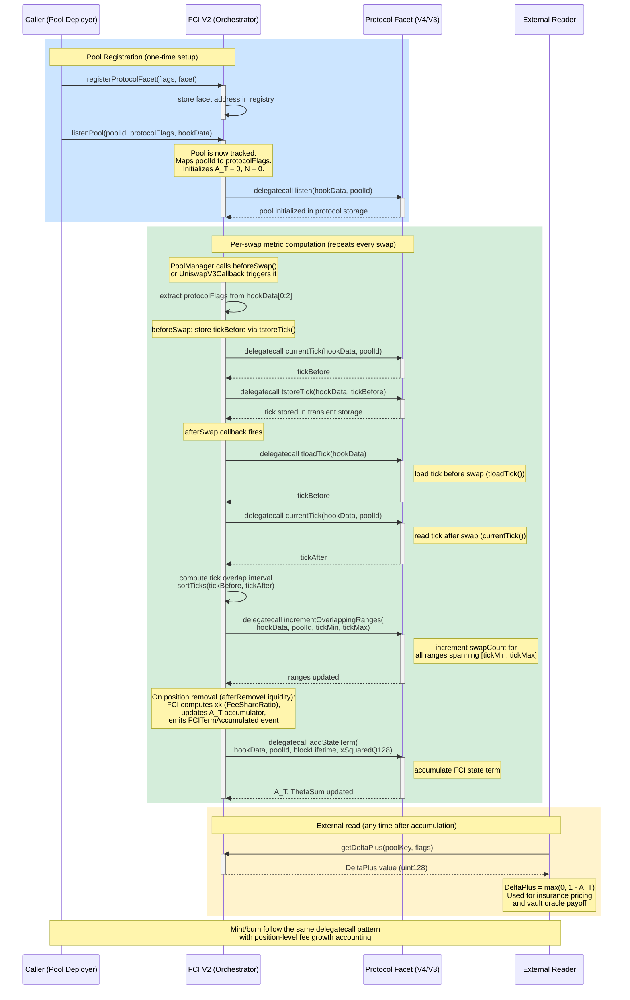

<p align="center">
  <picture>
    <source media="(prefers-color-scheme: dark)" srcset="assets/logo/thetaswap-hero-dark.svg" />
    <source media="(prefers-color-scheme: light)" srcset="assets/logo/thetaswap-hero-mono.svg" />
    
  </picture>
</p>

<h2 align="center">thetaswap</h2>

<p align="center">
  Fee concentration insurance for Uniswap V4 passive LPs
</p>

<p align="center">
  <a href="#quick-start">Quick Start</a> · <a href="#overview">Overview</a> · <a href="#architecture">Architecture</a> · <a href="#repository-structure">Directory</a>
</p>

---

## Prerequisites

- [Foundry](https://book.getfoundry.sh/getting-started/installation) (forge, cast, anvil)
- Python >= 3.11
- [uv](https://docs.astral.sh/uv/) (Python package manager)

## Quick Start

```bash
# Clone
git clone https://github.com/wvs-finance/ThetaSwap-core.git
cd ThetaSwap-core

# One-command setup (submodules + venv + deps + Jupyter kernel)
make install

# Run all tests
make sol-test        # Solidity
make test-py         # Python
```

## Solidity

```bash
make show-build      # src-only build, no cache, optimized threads
make sol-test        # vault + FCI V2 test suites
make sol-test-demo   # NativeV4 FCI integration scenarios (full trace)
```

## Python (Econometrics + Backtest)

```bash
# Run Python tests
make test-py

# Execute all notebooks headless
make notebooks
```

Research code lives in `research/` — see [research/README.md](research/README.md) for details.

### Manual Python Setup (without Make)

```bash
uv venv uhi8 --python 3.13
uv pip install --python uhi8/bin/python -e ".[dev]"
```

### Running Notebooks

```bash
jupyter lab --notebook-dir=research/notebooks
```

Select the **thetaswap** kernel when opening notebooks.

## Repository Structure

```
src/
  fee-concentration-index-v2/  FCI V2 orchestrator + protocol facets
  fci-token-vault/             Insurance token vault
  libraries/                   Shared math libraries
  types/                       Type extensions (Ext.sol convention)
  protocol-adapter/            Reactive Network adapter
test/                          Forge tests (unit, fuzz, integration)
research/
  backtest/                    Insurance backtest engine
  econometrics/                Hazard + duration + cross-pool models
  data/                        Dune queries, fixtures, frozen datasets
  model/                       LaTeX spec + PDF
  notebooks/                   Reproducible result notebooks
  simulator/                   Python FCI simulator
  tests/                       Python test suite (114 tests)
specs/                         Per-feature contract specifications
script/                        Forge deployment scripts
docs/plans/                    Branch-specific implementation plans
lib/                           Foundry dependencies (submodules)
```

---

## Live Deployments (Sepolia + Lasna)

### Sepolia

| Component | Address |
|-----------|---------|
| FCI V2 (epoch) | `0xf42F17880a7c2291E4A46F8aB8D80685a700ed18` |
| Callback v3 | `0xE9938321c88003d0Dc187AA8c0365e813294788f` |
| V3 Pool (fee=500) | `0xF66da9dd005192ee584a253b024070c9A1A1F4FA` |
| Callback Proxy | `0xc9f36411C9897e7F959D99ffca2a0Ba7ee0D7bDA` |

### Lasna (Reactive Network)

| Component | Address |
|-----------|---------|
| UniswapV3Reactive | `0x7e0D0486098B5C02469E1f1E532853D1DDB6EFbD` |
| Lasna RPC | `https://lasna-rpc.rnk.dev` |

**Deployer EOA:** `0xe69228626E4800578D06a93BaaA595f6634A47C3`

The Reactive Network listens for on-chain events (Mint, Burn, Swap) on any supported chain and fires a callback to the FCI oracle on its destination chain with the translated hook calldata. This lets the oracle track pools that were never deployed with the FCI hook address, including existing Uniswap V3 pools on mainnet.

---

## Overview

When multiple liquidity providers supply capital to a DEX pool, each should earn a fee share proportional to their contributed liquidity. In practice, a small number of sophisticated actors -- JIT providers and MEV-aware strategies -- concentrate fee revenue away from passive participants, diluting their effective fee rate without generating proportional volume. This is **adverse competition**, a risk dimension orthogonal to both impermanent loss and loss-versus-rebalancing (LVR). ThetaSwap builds the first on-chain adverse competition oracle: the Fee Concentration Index (FCI) Hook tracks fee share distribution across protocols (Uniswap V3 via Reactive Network, V4 natively) and derives a `DeltaPlus` value that prices the insurance-relevant deviation from the competitive equilibrium baseline. See [research/README.md](research/README.md) for the full empirical evidence.

## Architecture

FCI Hook is a protocol-agnostic orchestrator that dispatches behavioral calls via `delegatecall` to registered protocol facets.

### Pool Listening Flow

Mint and burn follow the same delegatecall dispatch pattern.


