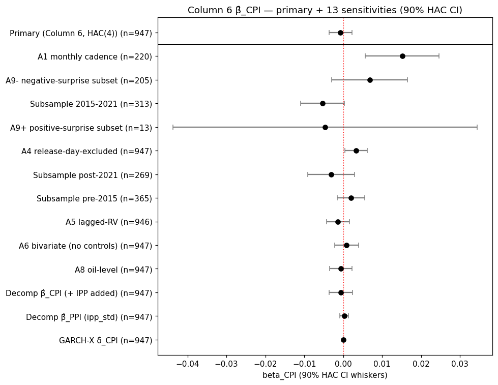

# FX-vol-on-CPI-surprise — Colombia 2008-2026

**Gate Verdict: FAIL** — β̂_CPI = -0.000685 (HAC(4) SE = 0.001794, 90% CI = [-0.003635, 0.002265], n = 947).

Primary Column-6 OLS of weekly RV^(1/3) on the AR(1)-filtered CPI surprise plus six controls, estimated on the Colombian weekly panel from 2008-01-07 to 2026-02-23. The one-sided T3b gate rule β̂_CPI − 1.28·SE > 0 is the pre-committed primary; the above headline is a single deterministic summary of that test outcome.

## Primary Results

| Specification | β̂ | SE | 90% CI lower | 90% CI upper | n |
|---|---|---|---|---|---|
| Primary (Column 6, HAC(4)) | -0.000685 | 0.001794 | -0.003635 | 0.002265 | 947 |
| GARCH-X δ̂_CPI | 0.000000 | 0.000000 | -0.000000 | 0.000000 | 947 |
| Decomposition β̂_CPI (+ IPP) | -0.000605 | 0.001838 | -0.003628 | 0.002417 | 947 |
| Decomposition β̂_PPI (ipp_std) | 0.000245 | 0.000682 | -0.000877 | 0.001367 | 947 |

All confidence intervals are two-sided 90% normal-approximation whiskers (±1.645·SE) on the primary point estimate. Coverage is HAC(4) robust on the OLS blocks and QMLE on the GARCH-X block.

## Reconciliation

| Check | Verdict |
|---|---|
| GARCH-X vs OLS primary sign/magnitude reconciliation | AGREE |
| Bootstrap vs HAC 90% CI agreement (NB2 §3.5) | AGREEMENT |

The reconciliation column summarises whether the three top-level estimators (OLS primary, GARCH-X, PPI decomposition) agree on sign and order of magnitude for the CPI-surprise loading. The bootstrap-HAC agreement flag encodes whether the stationary-bootstrap 90% CI for β̂_CPI and the HAC(4) 90% CI overlap by at least 50%.

## Forest Plot

Thirteen specifications are plotted with 90% HAC CI whiskers: the primary Column-6 anchor at the top (divider below), then A1/A4/A5/A6/A8/A9+/A9- refits, three subsample regimes, the GARCH-X loading, and the PPI decomposition rows. A2/A3/A7 are carried forward from NB2 §10 per the Task 27 scope boundary; see that section for those rows.

**Note on pre-registered sensitivities.** The forest plot shows two rows (A1 monthly cadence, A4 release-day-excluded) with 90% CI excluding zero in the positive direction. Under a T3b-PASS gate these would have been material-mover candidates; under the current T3b-FAIL state, the pre-committed anti-fishing protocol (Simonsohn, Simmons & Nelson 2020; Ankel-Peters, Brodeur & Connolly 2024) halts spotlight promotion to prevent specification-search bias. The rejecting-but-not-rescue rows are preserved here for reader transparency, not for gate revision.

## Per-Test Gate Table

| Test | Verdict | Role |
|---|---|---|
| T1 consensus rationality (Mincer-Zarnowitz F) | FAIL | Auxiliary gate |
| T2 Levene announcement-channel | FAIL | Auxiliary gate |
| T3a two-sided β ≠ 0 | FAIL TO REJECT | Diagnostic |
| T3b one-sided β > 0 (PRIMARY) | FAIL | Primary gate |
| T4 Ljung-Box Q(1..8) | FAIL | Diagnostic |
| T5 Jarque-Bera | FAIL | Diagnostic |
| T6 Bai-Perron alignment | FAIL | Diagnostic |
| T7 intervention-dummy adequacy | PASS | Auxiliary gate |

Material movers from NB3 §9 two-pronged rule: 0. PKL degraded (NB2→NB3 version drift): False.

Aggregation rule (Rev 4 spec): T3b FAIL ⇒ final FAIL regardless of other tests. T3b PASS plus all of (T1, T2, T7) PASS ⇒ final PASS. Diagnostic tests (T3a, T4, T5, T6) are recorded for auditability and do not gate the final verdict.

## Reports

- [NB1 Data EDA PDF](pdf/01_data_eda.pdf) — *pending `just notebooks` generation*
- [NB2 Estimation PDF](pdf/02_estimation.pdf) — *pending `just notebooks` generation*
- [NB3 Tests and Sensitivity PDF](pdf/03_tests_and_sensitivity.pdf) — *pending `just notebooks` generation*

PDFs are produced by the `just notebooks` recipe; until that recipe has run in a given worktree, the three links above resolve to missing files (the `pdf/` directory ships empty in a clean clone). The JSON handoff artifacts (`nb1_panel_fingerprint.json`, `nb2_params_point.json`, `nb2_params_full.pkl`, `gate_verdict.json`) live under `estimates/` and are always present.

---

*Spec hash: `5d86d01c5d2ca58587f966c2b0a66c942500107436ecb91c11d8efc3e65aa2c6`*

*Panel fingerprint: `769ec955e72ddfcb6ff5b16e9c949fd8f53d9e8c349fc56ce96090fce81d791f`*
