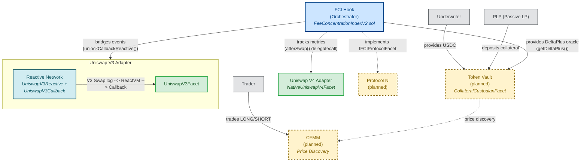

# FCI System Context Diagram

The Fee Concentration Index (FCI) Hook is a protocol-agnostic orchestrator that tracks adverse selection metrics across any DEX protocol. It dispatches behavioral calls via `delegatecall` to registered protocol facets, each implementing `IFCIProtocolFacet`. The diagram below shows all live integrations (solid borders), planned components (dashed borders), and external actors who interact with the system.

**Legend:** Solid border = live on testnet. Dashed border = planned / not yet deployed. Edge labels show plain-English description with Solidity function name in parentheses where applicable.

