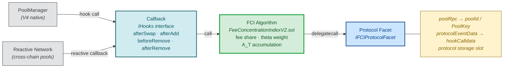

# FCI System Context Diagram

The FCI architecture is a delegation chain: external sources (PoolManager for V4-native, Reactive Network for cross-chain) trigger callbacks, which invoke the FCI Algorithm. The algorithm `delegatecall`s into protocol facets that adapt protocol-specific data to the algorithm's interface.

