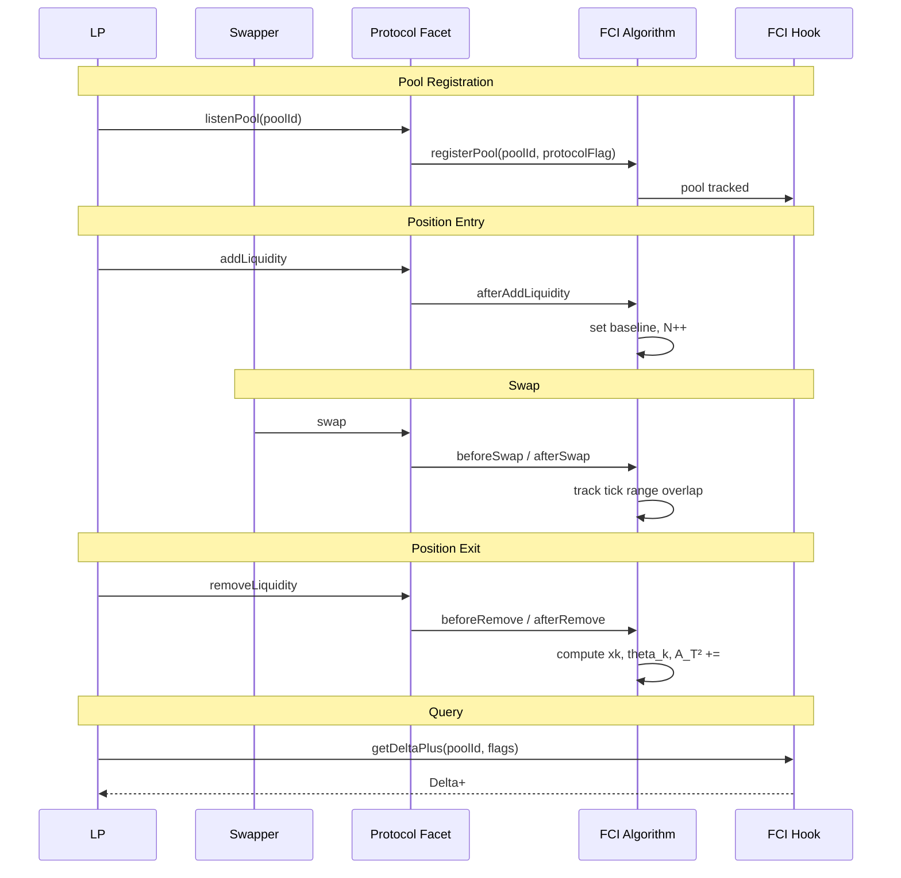

# FCI Pool Listening Flow — Sequence Diagram

High-level flow: LP subscribes a pool via the protocol facet, positions and swaps are tracked, and the FCI Hook exposes the derived metrics.

```mermaid
sequenceDiagram
    participant LP as LP
    participant SW as Swapper
    participant PF as Protocol Facet
    participant FCI as FCI Algorithm
    participant Hook as FCI Hook

    Note over LP,Hook: Pool Registration
    LP->>PF: listenPool(poolId)
    PF->>FCI: registerPool(poolId, protocolFlag)
    FCI->>Hook: pool tracked

    Note over LP,Hook: Position Entry
    LP->>PF: addLiquidity
    PF->>FCI: afterAddLiquidity
    FCI->>FCI: set baseline, N++

    Note over SW,Hook: Swap
    SW->>PF: swap
    PF->>FCI: beforeSwap / afterSwap
    FCI->>FCI: track tick range overlap

    Note over LP,Hook: Position Exit
    LP->>PF: removeLiquidity
    PF->>FCI: beforeRemove / afterRemove
    FCI->>FCI: compute xk, theta_k, A_T² +=

    Note over LP,Hook: Query
    LP->>Hook: getDeltaPlus(poolId, flags)
    Hook-->>LP: Delta+
```
