# CFMM from Payoff

## Overview

**Derive a complete CFMM specification from a target payoff through mandatory interactive questioning.** Every derivation step requires an AskUserQuestion before proceeding. You do NOT assume — you ASK.

The Geometry paper (Angeris et al. 2023) establishes that every CFMM has a canonical trading function and that CFMM objects — trading function, reserves, prices, liquidity — are geometrically related. This skill uses those relationships to derive a complete CFMM from any starting object (payoff, trading function, or reserve curve), asking the user to confirm each derivation step.

### Foundation Papers (non-negotiable)

1. **Angeris, Chitra, Diamandis, Evans, Kulkarni**, "The Geometry of Constant Function Market Makers" (2023, arXiv:2308.08066) — THE backbone. Establishes the geometric axioms: every CFMM has a unique canonical trading function (nondecreasing, concave, homogeneous). Shows how to move between CFMM objects: trading set ↔ trading function ↔ reserves ↔ prices. Generalizes without requiring differentiability or homogeneity.

2. **Angeris, Evans, Chitra**, "Replicating Market Makers" (2021, arXiv:2103.14769) — How to construct a CFMM that replicates a given concave payoff. Reserve derivation: `x(p) = -V'(p)`. Oracle-assisted construction.

3. **Angeris, Evans, Chitra**, "Replicating Monotonic Payoffs Without Oracles" (2022, arXiv:2111.13740) — Oracle-free construction for monotone concave payoffs. Virtual reserve technique.

4. **Angeris, Evans, Chitra, Boyd**, "A Primer on Perpetuals" (2022, arXiv:2209.03307) — Funding rates, discount rates, and replication strategies for perpetual contracts. **Reference this when the user chooses perpetual expiry in Phase 1.** Defines the funding rate mechanism that replaces settlement, and derives replication for the short side when prices can jump.

5. **Angeris, Chitra**, "Improved Price Oracles: Constant Function Market Makers" (2020, arXiv:2003.10001) — Price oracle properties of CFMMs.

Output: LaTeX files in `specs/model/` that feed directly into the type-driven-development skill.

## The Iron Law

```
NO DERIVATION STEP WITHOUT AN ASKUSERQUESTION FIRST
```

Derived the reserves without confirming payoff direction? Delete it.
Chose a framework without asking the user? Delete it.
Wrote a LaTeX file without confirming notation? Delete it.

**Violating the letter of the rules is violating the spirit of the rules.**

### Anti-Leading Rule

When presenting AskUserQuestion options, you MUST NOT:
- Pre-select or recommend a default ("Option 2 is generally preferred...")
- Frame one option as obviously correct ("For your case, you'd want...")
- Add qualifiers that steer ("Most projects use...", "The simpler approach is...")

Present options neutrally. The user decides. If the user asks for a recommendation, give one — but only after they ask.

### No Batching Questions

Each AskUserQuestion is ONE question with ONE decision. Do NOT combine questions from different phases into a single message. Do NOT write the next phase's derivation while waiting for the current question's answer.

### Explicit Conversion Rule

When the user's stated payoff differs from the LP's payoff (e.g., user says `max(S-K,0)` but LP holds `min(S,K)`), you MUST:
1. Show the user's original payoff
2. Show the converted LP payoff with explicit derivation: "LP payoff = underlying - user's payoff" or equivalent
3. Ask the user to confirm the CONVERTED payoff in Question 1a, not the original

Do NOT silently convert. Do NOT treat Question 0a confirmation as settling the conversion — the conversion must be shown explicitly at Question 1a.

## Process

```dot
digraph cfmm_from_payoff {
    "User states target payoff" [shape=doublecircle];
    "ASK: Payoff clarification" [shape=box];
    "ASK: Convexity check" [shape=box];
    "ASK: Framework choice" [shape=box];
    "ASK: Expiry mechanics" [shape=box];
    "Perpetual?" [shape=diamond];
    "ASK: Funding rate (Primer on Perpetuals)" [shape=box];
    "ASK: Numeraire and units" [shape=box];
    "Derive reserves (Geometry paper)" [shape=box];
    "ASK: Review reserve derivation" [shape=box];
    "Derive trading function (Geometry paper)" [shape=box];
    "ASK: Review trading function" [shape=box];
    "Derive fee structure" [shape=box];
    "ASK: Review fee structure" [shape=box];
    "Derive initialization" [shape=box];
    "ASK: Review initialization" [shape=box];
    "Write invariants" [shape=box];
    "ASK: Review invariants" [shape=box];
    "Write LaTeX files" [shape=box];
    "ASK: Review LaTeX output" [shape=box];
    "Hand off to TDD skill" [shape=doublecircle];

    "User states target payoff" -> "ASK: Payoff clarification";
    "ASK: Payoff clarification" -> "ASK: Convexity check";
    "ASK: Convexity check" -> "ASK: Framework choice";
    "ASK: Framework choice" -> "ASK: Expiry mechanics";
    "ASK: Expiry mechanics" -> "Perpetual?";
    "Perpetual?" -> "ASK: Funding rate (Primer on Perpetuals)" [label="yes"];
    "Perpetual?" -> "ASK: Numeraire and units" [label="no"];
    "ASK: Funding rate (Primer on Perpetuals)" -> "ASK: Numeraire and units";
    "ASK: Numeraire and units" -> "Derive reserves (Geometry paper)";
    "Derive reserves (Geometry paper)" -> "ASK: Review reserve derivation";
    "ASK: Review reserve derivation" -> "Derive trading function (Geometry paper)";
    "Derive trading function (Geometry paper)" -> "ASK: Review trading function";
    "ASK: Review trading function" -> "Derive fee structure";
    "Derive fee structure" -> "ASK: Review fee structure";
    "ASK: Review fee structure" -> "Derive initialization";
    "Derive initialization" -> "ASK: Review initialization";
    "ASK: Review initialization" -> "Write invariants";
    "Write invariants" -> "ASK: Review invariants";
    "ASK: Review invariants" -> "Write LaTeX files";
    "Write LaTeX files" -> "ASK: Review LaTeX output";
    "ASK: Review LaTeX output" -> "Hand off to TDD skill";
}
```



## Phase 0 — Payoff Clarification (MANDATORY)

Before ANY math, use AskUserQuestion to resolve ambiguity. The user's stated payoff is almost always ambiguous in at least one critical dimension.

### Question 0a: Whose payoff?

```
AskUserQuestion: "Whose perspective is the payoff from?"

Options:
1. LP perspective (the CFMM holder's payoff — typically concave)
2. Trader perspective (the counterparty's payoff — typically convex)
3. I stated the LP payoff directly
4. I'm not sure — help me figure it out
```

**Why this matters:** The Angeris replication theorem requires a CONCAVE payoff for the LP. If the user gives a convex payoff like `max(S-K, 0)`, the LP's payoff is the WRITER's position `min(S, K)`. Getting this wrong produces a CFMM where LPs systematically lose money in the wrong direction. This error is subtle enough to survive code review.

### Question 0b: Payoff variables

```
AskUserQuestion: "What are the payoff variables?"

Options (multi-select):
1. S_T = spot price of risky asset at time T
2. S_t = spot price at any time t (path-dependent)
3. Multiple underlying assets (specify)
4. Other variables (describe)
```

### Question 0c: Monotonicity

```
AskUserQuestion: "Is the LP's payoff monotonically non-decreasing in the price of the risky asset?"

Options:
1. Yes — payoff never decreases as price rises (e.g., covered call writer: min(S,K))
2. No — payoff decreases in some regions (e.g., straddle)
3. I'm not sure — show me the payoff plot regions
```

**Why this matters:** Angeris 2022 ("Replicating Monotonic Payoffs Without Oracles") only applies to monotone payoffs. Non-monotone payoffs require oracle-assisted construction or decomposition into monotone components.

## Phase 1 — Convexity and Framework Selection (MANDATORY)

### Question 1a: Convexity verification (with explicit conversion)

If the user's stated payoff differs from the LP's payoff (identified in Question 0a), you MUST show the conversion explicitly:

```
AskUserQuestion: "You stated the payoff max(S-K, 0) from the trader's perspective.

The LP holds the opposite side. Here is the conversion:
- User's stated payoff (trader/buyer): max(S-K, 0)  [CONVEX — cannot be replicated by LP]
- LP's payoff (writer): S - max(S-K, 0) = min(S, K)  [CONCAVE — replicable]

The LP payoff V(p) = min(p, K) has the following convexity:
- V''(p) = 0 for p ≠ K; kink at p = K
- V is concave: min is always concave ✓
- V is monotone non-decreasing: increases for p < K, flat for p ≥ K ✓

Does this conversion and analysis match your understanding?"

Options:
1. Yes, the LP holds min(S, K) — proceed
2. No, I intended the LP payoff to be [different]
3. Can you explain what concavity means for CFMM replication?
```

**The conversion step is mandatory.** Do not skip it even if the user said "LP perspective" in Question 0a — show the work so the user can verify.

### Question 1b: Geometry paper object path

The Geometry paper (2308.08066) establishes that CFMM objects are related through well-defined geometric transformations. Before choosing a replication framework, confirm which derivation path to follow:

```
AskUserQuestion: "The Geometry paper defines several equivalent CFMM representations. Which object are you starting from?"

Options:
1. Payoff V(p) → derive reserves → derive trading function (replication path)
2. Trading function ψ(x,y) → derive reserves → verify payoff (inverse path)
3. Reserve curves x(p), y(p) → derive trading function → verify payoff
4. Trading set S → derive canonical trading function → derive everything else
```

This determines the order of derivations in Phases 2-3.

### Question 1c: Framework choice

```
AskUserQuestion: "Which replication framework should we use?"

Options:
1. Angeris 2021 (oracle-assisted) — requires external price oracle; handles any concave payoff; simpler construction
2. Angeris 2022 (oracle-free) — no oracle needed; only monotone concave payoffs; more complex construction with virtual reserves
3. Help me choose — explain tradeoffs
```

Present tradeoffs ONLY if the user asks (option 3):
- Oracle-assisted: simpler math, but oracle manipulation risk
- Oracle-free: no oracle dependency, but only works for monotone payoffs and requires virtual reserve construction

### Question 1d: Expiry mechanics

```
AskUserQuestion: "Does this CFMM have a maturity/expiry?"

Options:
1. Yes — fixed expiry T (e.g., options-like)
2. No — perpetual mechanism (e.g., continuous liquidity provision)
3. Rolling — periodic reset/settlement (e.g., funding rate)
```

### Question 1e: Perpetual funding rate (ONLY if perpetual chosen)

When the user selects perpetual expiry, reference "A Primer on Perpetuals" (arXiv:2209.03307):

```
AskUserQuestion: "For perpetual CFMMs, the Primer on Perpetuals (Angeris 2022) defines funding rate mechanisms. Which model?"

Options:
1. Continuous funding rate — r(t) continuously adjusts mark-to-index spread
2. Discrete funding periods — funding exchanged at fixed intervals
3. Embedded in fee — funding rate absorbed into swap fee φ
4. Help me understand — explain the Primer's funding rate derivation
```

If the user picks option 4, summarize from arXiv:2209.03307:
- The funding rate is the cost of maintaining a perpetual position equivalent to the expiring payoff
- It replaces settlement: instead of converging at expiry, the perpetual converges via continuous payments
- The short-side replication strategy under price jumps determines the funding rate bounds
- Funding rate = derivative of the basis (mark - index) with respect to time

```
AskUserQuestion: "The Primer also addresses price jumps. Should the funding rate account for jump risk?"

Options:
1. Yes — use the jump-adjusted replication from the Primer
2. No — assume continuous price paths (simpler, but vulnerable to gaps)
3. I need to understand the difference
```

### Question 1f: Settlement mechanics (ONLY if fixed expiry chosen)

```
AskUserQuestion: "How should the CFMM handle expiry?"

Options:
1. Settlement — reserves distributed to LPs at T based on final price
2. Withdrawal-only — no new swaps after T, LPs withdraw
3. Rollover — automatically extends to new period
4. I need help deciding
```

### Question 1g: Numeraire and units

```
AskUserQuestion: "What is the unit of account?"

Options:
1. Token Y is the numeraire (prices denominated in Y)
2. Token X is the numeraire
3. External unit (e.g., USD via oracle)
4. Other (specify)
```

```
AskUserQuestion: "What is the strike/parameter K denominated in?"

(Only if payoff has parameters like K)

Options:
1. Same as numeraire
2. Different (specify)
```

### Question 1h: Payoff parameter mutability

If the payoff has parameters (strike K, cap, floor, etc.):

```
AskUserQuestion: "Is the payoff parameter K fixed or mutable?"

Options:
1. Fixed — K is a constant set at deployment, never changes
2. Mutable — K can be updated (e.g., rolling strike, governance-adjustable)
3. Time-dependent — K = K(t) follows a schedule
4. I'm not sure yet
```

**Why this matters:** If K is mutable, it becomes a state variable in the TLA+ model. The invariant set needs a CFMM-28+ covering strike update safety (e.g., no mid-swap K change, K update preserves reserve non-negativity). A fixed K is simpler — it's a constructor parameter.

## Phase 2 — Reserve Derivation

**Only proceed here after ALL Phase 0 and Phase 1 questions are answered.**

### Derivation procedure

Use the Geometry paper's framework to derive reserves from the chosen starting object.

If starting from payoff V(p) (the replication path):

1. Risky asset reserve: `x(p) = -V'(p)` (Angeris 2021, Prop. 1; Geometry paper Section 3)
2. Numeraire reserve: `y(p) = V(p) - p · V'(p)` (Legendre-Fenchel relationship)
3. Verify: `x(p) ≥ 0` for all p in domain (non-negative reserves)
4. Verify: `x(p)` is non-increasing in p (monotone reserve curve — Geometry paper, concavity of canonical trading function implies this)
5. Verify: the trading set `S = {(x,y) : y ≥ V*(x)}` is convex (Geometry paper axiom)

### Question 2a: Review reserve derivation

Present the derived `x(p)` and `y(p)` with full working:

```
AskUserQuestion: "Here are the derived reserve curves. Please review:"

Show:
- x(p) = [formula] with derivation steps
- y(p) = [formula] with derivation steps
- Domain: p ∈ [p_min, p_max]
- Plot description: x decreases as p increases (risky sold as price rises)
- Geometry paper verification: trading set convexity ✓/✗

"Are these correct?"

Options:
1. Correct — proceed to trading function
2. Something looks wrong at [specific point]
3. Can you verify with a numerical example at price p = [value]?
```

## Phase 3 — Trading Function Derivation

### Derivation procedure

The Geometry paper (Section 2) establishes: every CFMM has a unique canonical trading function ψ that is nondecreasing, concave, and 1-homogeneous. Derive it:

1. From x(p) and y(p), eliminate p to get y = f(x) or ψ(x, y) = C
2. The trading set is: `S = {(x, y) : ψ(x, y) ≥ C}` (Geometry paper Def. 2)
3. Verify: ψ is concave in (x, y) — required for the trading set to be convex (Geometry paper Thm. 1)
4. Verify: level sets of ψ match the reserve curve from Phase 2
5. Verify: the canonical form is 1-homogeneous (Geometry paper Prop. 3) — if not, find the canonical equivalent

### Question 3a: Trading function form

```
AskUserQuestion: "The trading function can be expressed in multiple forms (Geometry paper Section 2):"

Show:
- Implicit: ψ(x, y) = C
- Explicit: y = f(x) (if invertible)
- Parametric: (x(p), y(p)) parameterized by price p
- Canonical: the unique nondecreasing, concave, 1-homogeneous form (Geometry paper Thm. 1)

"Which form do you prefer as the primary specification?"

Options:
1. Canonical form — most general, guaranteed unique by Geometry paper
2. Implicit ψ(x, y) = C — standard in literature
3. Explicit y = f(x) — simpler, if the relationship is invertible
4. Both canonical and explicit
```

### Question 3b: Degeneracy check (MANDATORY)

After deriving ψ, check if it is degenerate (linear). A linear trading function means the CFMM only trades at a single price — infinite slippage everywhere else. This is mathematically correct but practically unusable without modification.

If ψ is linear (e.g., `ψ(x,y) = Kx + y` for a covered call):

```
AskUserQuestion: "The derived trading function ψ(x,y) = Kx + y is LINEAR.

This means:
- The CFMM only executes at exactly one price (p = K)
- Infinite slippage at any other price
- Mathematically correct replication, but practically unusable as-is

Options to address this:"

Options:
1. Accept the degenerate form — this is intentional (e.g., for a limit-order-like CFMM)
2. Add concentrated liquidity around K — use tick-based construction from the FSM paper
3. Smooth the payoff with a parameter — replace kink at K with a smooth transition region of width δ
4. I need to understand what degeneracy means for my use case
```

Do NOT skip this question when ψ is linear. A degenerate CFMM is a valid mathematical object but the user must consciously choose it.

### Question 3c: Review trading function

```
AskUserQuestion: "Here is the derived trading function:"

Show:
- ψ(x, y) = [formula]
- Verification: ψ is concave ✓/✗
- 1-homogeneity check: ψ(λx, λy) = λψ(x,y) ✓/✗
- Spot price: p = -∂ψ/∂x / ∂ψ/∂y = [formula]
- Comparison: does p from trading function match p from reserve curves?
- Degeneracy: linear/nonlinear [and user's choice from Question 3b if applicable]

"Does this look correct?"

Options:
1. Correct — proceed to fees
2. The price formula doesn't match — let me check
3. Can you verify at a boundary (e.g., p = K)?
```

### Question 3d: Liquidity scaling

```
AskUserQuestion: "How should liquidity scale when multiple LPs provide different amounts?"

Show:
- Current derivation assumes unit liquidity: ψ(x,y) = C for one LP
- With L units of liquidity: ψ(x/L, y/L) = C (by 1-homogeneity, if canonical)
- LP share minting: new_shares = f(Δx, Δy, current_reserves)

"How should LP shares relate to the invariant?"

Options:
1. Pro-rata — shares proportional to fraction of reserves added: ΔL/L = Δx/X = Δy/Y
2. Single-sided — allow adding one token, derive the other from the invariant curve
3. This CFMM has a single LP (no share accounting needed)
4. I need help understanding the options
```

## Phase 4 — Fee Structure Derivation

**Do NOT bolt on a proportional fee.** The fee must be derived from or proven compatible with the replication framework.

### Question 4a: Fee approach

```
AskUserQuestion: "How should fees interact with the replication property?"

Options:
1. Replication-preserving — fees accrue separately, do not affect the reserve invariant (Bartoletti gain formula applies)
2. Replication-approximate — fees modify reserves, replication holds within bounded error ε
3. Project convention — use φ = 4·max(gasCost) from DraftLiquiditySupplySimplestModel
4. Help me understand the tradeoffs
```

### Question 4b: Fee accumulation

```
AskUserQuestion: "How should fees accumulate?"

Options:
1. Per-swap fee on input token (standard: Δx_effective = (1-φ)·Δx)
2. Per-swap fee on output token
3. Time-weighted fee (accrues with time, not volume)
4. Dynamic fee from hook
```

### Question 4c: Perpetual funding rate as fee component (ONLY if perpetual)

If the CFMM is perpetual (from Phase 1d), the funding rate from "A Primer on Perpetuals" interacts with fees:

```
AskUserQuestion: "For perpetuals, the funding rate and swap fee are separate economic mechanisms. How should they compose?"

Options:
1. Additive — total LP cost = swap fee + funding rate
2. Funding rate embedded in dynamic fee — φ(t) adjusts to include funding
3. Separate accounting — fee accrues to LPs, funding rate accrues to/from position holders
4. Help me understand the Primer's approach
```

### Question 4d: Review fee structure (with proof, not assertion)

Present the fee-adjusted invariant and verify replication still holds. **You MUST show the derivation of the error bound, not just state it.** "Direct calculation" or "by inspection" is not a proof.

```
AskUserQuestion: "Here is the fee-adjusted specification:"

Show:
- Fee model: [formula]
- Modified swap equation: [formula]
- Replication error bound DERIVATION:
  * Start: ψ(x - Δx, y + Δy) = C (no-fee invariant)
  * With fee: ψ(x - (1-φ)Δx, y + Δy') = C'
  * Error: |C' - C| = [derived formula with steps]
  * Bound: ε ≤ [formula] because [reasoning]
- Compatibility with Bartoletti gain(Γ,t): [yes/no/modified, with reference to specific theorem]
- (If perpetual) Funding rate interaction: [description]

"Is this acceptable?"

Options:
1. Yes — proceed to initialization
2. The error bound derivation has a gap at [step]
3. I want a different fee model
```

**The error bound must be DERIVED, not CLAIMED.** If you cannot derive the bound, state that explicitly and ask the user whether to proceed with an unproven bound or change the fee model.

## Phase 5 — Initialization

### Question 5a: Initial conditions

```
AskUserQuestion: "How should the CFMM be initialized?"

Options:
1. From initial spot price p₀ — derive (x₀, y₀) such that ψ(x₀, y₀) = C and price = p₀
2. From initial reserves (x₀, y₀) — derive C and initial price
3. From initial liquidity L₀ and price p₀
```

### Question 5b: Review initialization

Present the initialization derivation:

```
AskUserQuestion: "Initialization specification:"

Show:
- Given: [user's chosen input]
- Derived: (x₀, y₀) = [values/formulas]
- Invariant constant: C = [value/formula]
- Spot price at init: p₀ = [value/formula]
- LP value at init: V(p₀) = [value/formula]

"Does this match your expectations?"

Options:
1. Correct — proceed to invariants
2. The initial LP value should be [different]
3. Can you show a numerical example?
```

## Phase 6 — Replication-Specific Invariants

Write invariants that extend the 19 mandatory CFMM invariants from the cfmm-specification submodule.

### Mandatory replication invariants (CFMM-20+)

| ID | Name | Hoare Triple | Source |
|---|---|---|---|
| CFMM-20 | Replication accuracy | {V(p)} → evolve(p→p') → {\|LP_value(p') - V(p')\| ≤ ε} | Angeris 2021 Prop. 1 |
| CFMM-21 | LP payoff concavity | {p₁ < p₂ < p₃} → {V(p₂) ≥ λ·V(p₁) + (1-λ)·V(p₃)} | Geometry paper Thm. 1 |
| CFMM-22 | Reserve monotonicity | {p' > p} → {x(p') ≤ x(p) ∧ y(p') ≥ y(p)} | Geometry paper, concavity |
| CFMM-23 | Boundary reserves | {p → 0} → {x → x_max ∧ y → 0} and {p → ∞} → {x → 0 ∧ y → y_max} | Geometry paper |
| CFMM-24 | Price-reserve consistency | {p = -∂ψ/∂x / ∂ψ/∂y} → {x(p), y(p) match reserve curves} | Geometry paper Section 3 |
| CFMM-25 | Canonical form uniqueness | ψ is nondecreasing, concave, 1-homogeneous | Geometry paper Thm. 1 |

If perpetual, add:

| ID | Name | Hoare Triple | Source |
|---|---|---|---|
| CFMM-26 | Funding rate convergence | {mark − index} → funding(Δt) → {\|mark' − index'\| < \|mark − index\|} | Primer on Perpetuals |
| CFMM-27 | Funding rate bounds | {r(t)} → {\|r(t)\| ≤ r_max} | Primer on Perpetuals |

### Question 6a: Additional invariants

```
AskUserQuestion: "Here are the mandatory replication invariants (CFMM-20 through CFMM-25, plus CFMM-26-27 if perpetual). Do you need additional feature-specific invariants?"

Show the table above.

Options:
1. These are sufficient
2. Add invariant for [specific property]
3. I need an invariant for the expiry/settlement behavior
4. I need an invariant for the fee-replication interaction
```

### Question 6b: Review all invariants

**The `invariants.tex` file MUST reproduce ALL invariants (CFMM-01 through CFMM-19 + CFMM-20+) in full.** Do NOT cite base invariants by reference ("see cfmm-specification.md"). The LaTeX document must be self-contained — an auditor reads `invariants.tex` without loading any other skill or submodule.

```
AskUserQuestion: "Complete invariant set for review:"

Show all invariants (CFMM-01 through CFMM-19 from base + CFMM-20+ from this derivation) — reproduced in full, not by reference.

"Do these capture all properties of this CFMM?"

Options:
1. Complete — proceed to LaTeX
2. Missing [specific property]
3. [Specific invariant] seems wrong
```

## Phase 7 — LaTeX Output

### File structure

```
specs/model/
  main.tex              # Master document, \input{} for all components
  preamble.tex          # Shared packages, notation, theorem environments
  payoff.tex            # Payoff definition, convexity analysis
  reserves.tex          # Reserve curve derivation (Geometry paper path)
  trading-function.tex  # Trading function derivation and canonical form verification
  fees.tex              # Fee structure and replication compatibility
  funding-rate.tex      # (perpetual only) Funding rate from Primer on Perpetuals
  initialization.tex    # Initial conditions derivation
  invariants.tex        # All invariants in Hoare triple format
  references.bib        # BibTeX: Geometry paper, Replicating MMs, Oracle-free, Primer on Perpetuals, Bartoletti, FSM
```

### Notation Contract (extends cfmm-specification)

Preserve ALL notation from cfmm-specification.md **including casing**:
- `X`, `Y` (CAPITAL) for reserves in Solidity/TLA+ context — NOT `x`, `y`
- `L_act` for active liquidity
- `F_x`, `F_y` for fee accumulators
- `p` for spot price, `i_c`, `i_l`, `i_u` for tick indices
- `φ` (phi) = trading fee rate
- Paper's pricing function `φ` → `ϕ` (varphi)

**Casing matters.** The cfmm-specification uses CAPITAL `X`, `Y` for reserves. The Angeris papers use lowercase `x`, `y`. In LaTeX, use the Angeris lowercase convention for mathematical derivations but MAP to capital `X`, `Y` in the notation table for TDD handoff. State this mapping explicitly in `preamble.tex`.

Add for replication (from Geometry paper and Replicating MMs):
- `V(p)` = LP payoff as function of spot price
- `ψ(x, y)` = trading function (Angeris notation; maps to reserves `X`, `Y` in TDD)
- `S` = trading set `{(x,y) : ψ(x,y) ≥ C}`
- `\mathcal{K}` = payoff parameter (strike, etc.) — avoids collision with other K usage
- `r(t)` = funding rate (perpetuals only, from Primer)

### LaTeX requirements

- `\begin{theorem}`, `\begin{proof}` structure — not informal prose
- Each theorem maps to a Kontrol proof: comment with `% Kontrol: prove_cfmm_<tier>_<name>`
- BibTeX citations for every paper reference (arXiv IDs mandatory)
- `\begin{invariant}` custom environment for Hoare triples

### Question 7a: Review LaTeX structure

```
AskUserQuestion: "Here is the planned LaTeX structure. Review before I write files:"

Show file list and notation table.

Options:
1. Approved — write the files
2. Change notation for [specific variable]
3. Add/remove a file
4. Change the document structure
```

### Question 7b: Per-file review

After writing EACH LaTeX file, ask:

```
AskUserQuestion: "I've written [filename]. Review before continuing?"

Options:
1. Approved — continue to next file
2. Changes needed: [describe]
```

**No batching LaTeX files. One file, one review, then next.**

## Phase 8 — Handoff to Type-Driven Development

After all LaTeX files are reviewed and approved:

```
AskUserQuestion: "Mathematical specification complete. Ready to begin type-driven development?"

Options:
1. Yes — invoke type-driven-development skill
2. Not yet — I want to review the full specification first
3. I need to modify [specific part] before proceeding
```

**REQUIRED BACKGROUND:** The type-driven-development skill drives the next phase. This skill produces the mathematical specification that feeds Phase 1 (Spec Kit) and Phase 2 (Invariants) of TDD.

Mapping from this skill's output to TDD phases:
- `specs/model/*.tex` → TDD Phase 1 input (the specification)
- CFMM-01 through CFMM-27+ → TDD Phase 2 (invariant definitions, already in Hoare triple format)
- Notation contract → TDD Phase 3 (UDVT naming: `V(p)` maps to value types, `x(p)` to ReserveX, etc.)

## Red Flags — STOP and Ask

- Deriving reserves without confirming payoff direction → STOP, ask Question 0a
- Choosing oracle-free vs oracle-assisted without asking → STOP, ask Question 1c
- Writing LaTeX without confirming notation → STOP, ask Question 7a
- Assuming proportional fee → STOP, ask Question 4a
- Skipping convexity check → STOP, ask Question 1a
- Writing multiple files without per-file review → STOP, one at a time
- Perpetual chosen but no funding rate discussion → STOP, ask Question 1e
- Linear/degenerate trading function without asking user → STOP, ask Question 3b
- "The payoff is obviously concave" → STOP, show the second derivative, ask user to confirm
- "I know which framework to use" → STOP, the user decides
- "This notation is standard" → STOP, the project has a notation contract
- "Funding rate is just a fee" → STOP, the Primer distinguishes them as separate mechanisms
- Framing a question with a recommended default → STOP, present options neutrally
- Combining questions from multiple phases into one message → STOP, one question per decision
- Writing a LaTeX file before receiving approval on the previous one → STOP, sequential only
- Asserting fee error bound without derivation → STOP, show the proof steps

| Rationalization | Reality |
|---|---|
| "The payoff direction is obvious" | Covered call: `max(S-K,0)` is buyer's (convex). LP holds writer's `min(S,K)` (concave). This error survives code review. |
| "Oracle-free is always better" | Oracle-free only works for monotone payoffs. Non-monotone requires oracle-assisted or decomposition. |
| "I'll derive fees after" | A fee that breaks replication makes the entire construction useless. Derive compatibility first. |
| "Expiry doesn't affect the math" | Perpetual vs fixed-expiry produces fundamentally different state machines. Perpetuals need funding rates (Primer on Perpetuals). |
| "The Geometry paper is just theory" | The Geometry paper proves your canonical trading function exists and is unique. Skipping it means your trading function may not be canonical — you lose uniqueness guarantees. |
| "Funding rate is just another fee" | The Primer on Perpetuals shows funding and fees are distinct mechanisms: fees compensate LPs for providing liquidity, funding rates maintain mark-index convergence. Conflating them breaks both. |
| "The user will catch notation errors" | Notation collisions between Angeris (ψ, φ) and project convention (φ = fee) cause silent bugs in proofs. |
| "I can batch the LaTeX files" | Each file may have errors that cascade to later files. Review one at a time. |
| "Initialization is trivial" | Wrong initial reserves mean the CFMM starts at the wrong price. This manifests as immediate arbitrage. |
| "For your case, you'd want option 2" | Anti-Leading Rule: present options neutrally. The user decides. Recommendations only when asked. |
| "The error bound is ε = φ·Volume" | Did you derive it? Show the steps. "By inspection" is not a proof. An unproven bound may be wrong. |
| "The base invariants are in the submodule" | The LaTeX must be self-contained. Reproduce CFMM-01 through CFMM-19 in full. An auditor should not need to load skills. |
| "A linear trading function is fine" | Linear ψ means single-price execution. The user must consciously choose this. Ask Question 3b. |
| "K is obviously a constant" | If K changes (rolling strike, governance update), it's a state variable. Ask Question 1h. |

## Quick Reference

| Phase | Output | Gate |
|---|---|---|
| 0. Payoff clarification | Confirmed V(p) with direction | AskUserQuestion x3 minimum |
| 1. Convexity & framework | Explicit conversion shown, framework chosen, expiry decided, object path selected, K mutability decided | AskUserQuestion x5-9 (more if perpetual) |
| 2. Reserves | x(p), y(p) derived via Geometry paper path | AskUserQuestion review |
| 3. Trading function | ψ(x,y) = C derived, degeneracy checked, canonical form verified, liquidity scaling decided | AskUserQuestion x3-4 |
| 4. Fees | Fee model with DERIVED error bound, compatible with replication | AskUserQuestion x3-4 (more if perpetual) |
| 5. Initialization | (x₀, y₀), C, p₀ derived | AskUserQuestion review |
| 6. Invariants | CFMM-01 through CFMM-19 reproduced in full + CFMM-20+ replication invariants | AskUserQuestion review |
| 7. LaTeX | `specs/model/*.tex` complete, self-contained | AskUserQuestion per file |
| 8. Handoff | Ready for TDD skill | AskUserQuestion confirmation |

**Minimum AskUserQuestion calls for a complete derivation: ~25 (more for perpetuals)**

## References

- Angeris, Chitra, Diamandis, Evans, Kulkarni, "The Geometry of Constant Function Market Makers" (2023, arXiv:2308.08066)
- Angeris, Evans, Chitra, "Replicating Market Makers" (2021, arXiv:2103.14769)
- Angeris, Evans, Chitra, "Replicating Monotonic Payoffs Without Oracles" (2022, arXiv:2111.13740)
- Angeris, Evans, Chitra, Boyd, "A Primer on Perpetuals" (2022, arXiv:2209.03307)
- Angeris, Chitra, "Improved Price Oracles: Constant Function Market Makers" (2020, arXiv:2003.10001)
- Parent skill: type-driven-development
- Submodule: cfmm-specification (19 mandatory invariants, notation contract)
